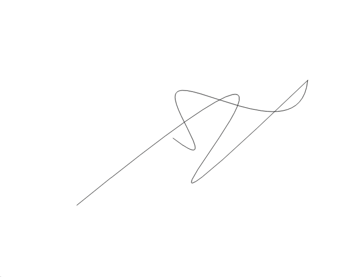

# Bezier


Fast and lightweight C++ library for Bezier curves of any order.



## Features

- Curves of any order (any number of control points)
- Fast operations on curves
- Dynamic manipulation
- Curve fitting, joining and offsetting
- Composite Bezier curves (polycurves)

## Quick start

```cpp
#include <Bezier/bezier.h>

// A cubic curve from four control points
Eigen::MatrixX2d control_points(4, 2);
control_points << 0.0, 0.0,
                  1.0, 2.0,
                  3.0, 2.0,
                  4.0, 0.0;
Bezier::Curve curve(control_points);

Bezier::Point       p       = curve.valueAt(0.5);    // point at t = 0.5
Bezier::Vector      tangent = curve.tangentAt(0.5);  // unit tangent
double              length  = curve.length();        // arc length
Bezier::BoundingBox bbox    = curve.boundingBox();

curve.raiseOrder();                                  // now quartic, same shape
```

## Operations

- Get value, derivative, curvature, tangent and normal for a parameter *t*
- Point projection onto curve
- Get curve length, step along curve by arc length
- Get a derivative curve (hodograph)
- Split into subcurves
- Find curve roots, extrema and bounding box
- Find points of intersection
- Raise/lower order
- Apply parametric and geometric continuities
- Fit a curve through a polyline
- Join two curves into a single fitted curve
- Offset a curve by a given distance

## Integration

The library is `find_package()` compatible:

```cmake
find_package(Bezier REQUIRED)
target_link_libraries(my_target PRIVATE Bezier::Bezier)
```

## Installation

```sh
git clone https://github.com/romb-technologies/Bezier
cd Bezier
cmake -B build
cmake --build build
cmake --install build
```

Build options (default `OFF`):

| Option | Description |
| --- | --- |
| `BUILD_SHARED_LIBS` | Build a shared library instead of a static one |
| `BUILD_TESTING` | Build the unit tests |
| `BUILD_EXAMPLE` | Build the Qt5 example application |

## Example application

A small Qt5 based program written as a playground for manipulating Bezier curves.
Enable it at configure time, then build and run:

```sh
cmake -B build -DBUILD_EXAMPLE=ON
cmake --build build
./build/example/bezier_example
```

A side panel shows live data (curve counts, selected curve order and length, offset)
and provides drawing tools:

- **Free-hand draw** — sketch a stroke that is fitted to a curve
- **Control points** — place control points one by one to build a curve
- **Help** — list of all mouse and keyboard actions (also shown by pressing <kbd>H</kbd>)

Curves can be selected, reshaped via their control points, split, joined, offset,
have their order raised/lowered, and inspected (bounding box, intersections,
extrema, curvature). See the help dialog for the full list of shortcuts.

## ROS 2

The package is a plain CMake package (`build_type: cmake`) that builds with colcon — no system-wide installation needed. Clone it into the `src` folder of your colcon workspace and build:

```sh
colcon build --packages-select bezier
```

## Dependencies

- [Eigen](https://eigen.tuxfamily.org) 3.3+
- Qt5 (Core, Gui, Widgets) — only for the example application

## License

[Apache License 2.0](LICENSE)

## Credit

Some algorithm implementations are based on [A Primer on Bezier Curves](https://pomax.github.io/bezierinfo/) by Pomax.

The development of this software was in part supported by the European Cohesion Fund, through grant number KK.03.2.2.04.314 "Software modules for advanced autonomous motion of load-transportation vehicles (Soft4AGV)" of the "Innovations of newly established SMEs - phase 2" open call.
